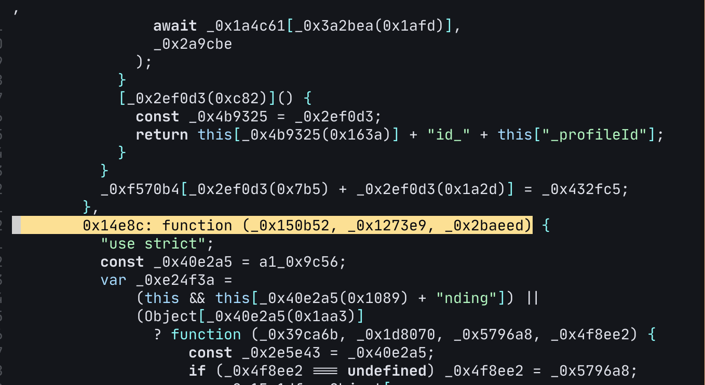
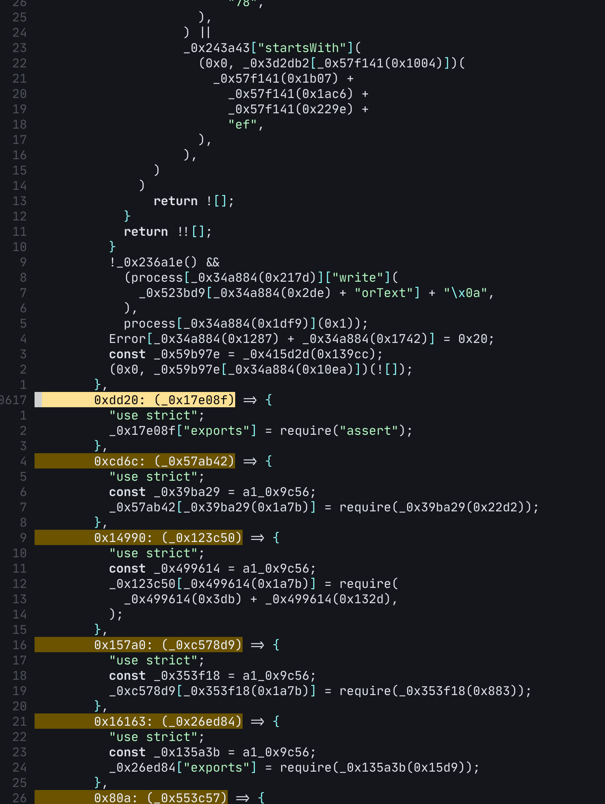
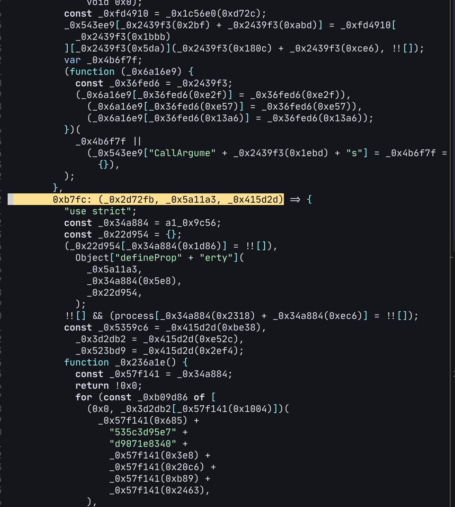
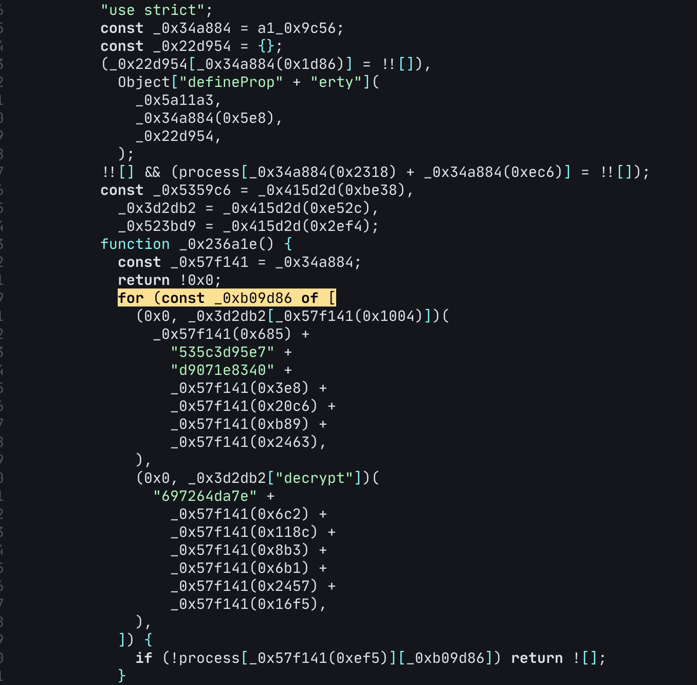

# use pylance!!!
## Step1: 下载+格式化
- 先在网页点击下载pylance.vsix: https://marketplace.visualstudio.com/items?itemName=ms-python.vscode-pylance&ssr=false#version-history
- 也可以在vscode中安装pylance最新版, 安装目录会在: `~/.vscode/extensions/ms-python.vscode-pylance-2023.2.30`
- `cd /path/to/pylance/extension/dist/`
- `prettier --write ./server.bundle.js`

## Step2: 定位+修改
- mvim打开`server.bundle.js`
- `G` goto the bottom of the file
- deprecated! 反向搜索(从底部向上搜索)这个pattern: `^ *0x.*function.*_0x.*_0x.*_0x.*)`, 结果如下图:

- updated! 反向搜索(从底部往上搜索)搜索pattern: `^ *0x.*: (_0x.*)`, 会有很多match, 只看其中输入参数为一个的, 实际上这段就是报错信息中的`license`不允许等等, 还是多种语言的, 这说明已经接近我们想要修改的地方
- 一直往上搜索, 直到类似结构的最后一个, 结果如下

- 修改1: 上图中光标位置上去两行, 将`!![]`反转成`![]`, 如果是`!0xx`, 那么将`!0x0`改成`!0x1`, 总之就是反转, 这样能避免 nvim 中 lsp init request的报错
- 移动上图中光标位置上一行: `},`找到与这个`}`match的`{`:

- 从该位置往下搜索`for (const.*[$`

- 修改2: 在上述位置的前一行插入: `return !0x0;`


- 测试: `node server.bundle.js --stdio` 通过!!!
# record pylance各版本添加`return !0x0;`行的位置:
2023.2.30: line 26099

2023.2.40: line 26118

2023.2.43: line 23401

2023.3.11: line 23431

2023.3.20: line 26940

2023.3.40: line 23878

2023.4.10: line 23850

2023.5.30: line 33086

2023.6.30: line 38544

2023.6.40: line 38509

2023.6.41: line 38764

2023.7.10: line 45089

2023.7.11: line 51267

2023.11.102: line 59012 + 59094

2024.3.100: line 60528 + 60615


# 重新将`server.bundle.js`变成单行
```shell
tr -d '\n' < server.bundle.js > packed_server.bundle.js
```
